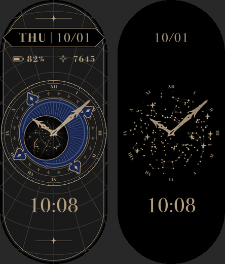

# Planisphere Watch

A planisphere-style watch face for the **Xiaomi Smart Band 11** (212×520), drawn entirely in code and packed into the band's native `.bin` format.



- A navy crescent with four spades sweeps once a minute as the seconds hand; its eccentric window reveals a real north-polar star map like a rotating planisphere.
- Roman numeral ring, sparkle band and tick ring in flat hairline gold on a charcoal capsule.
- Weekday / date plate, battery and steps, and a digital time under the dial.
- Separate always-on (AOD) face: full star field, numerals, hands, date and time on pure black.

Unofficial fan project; not affiliated with Xiaomi.

## Requirements

- macOS (the faces are rendered with the system font *Bodoni 72*)
- Python 3.11+, Node.js 22+, git

## Setup

```sh
./scripts/setup.sh
```

This clones [band10-toolkit](https://github.com/utsabfdahal/band10-toolkit) at a pinned commit into `vendor/`, applies `patches/band10-toolkit-widge-pointer.patch` (adds analog pointer widgets to its native packer), installs its npm packages, and creates `.venv`.

## Build

```sh
.venv/bin/python build.py
vendor/band10-toolkit/node_modules/.bin/tsx pack.mts
```

- `dist/planisphere-watch.bin` — installable face (ID `531900110`)
- `build/preview-normal-aod.png` — normal and AOD previews side by side (copied to `docs/preview.png`)
- `build/gmf/` — intermediate GMF project (`wfDef.json` + images)

Layout, colours and sizes are constants at the top of `build.py`.

The hour and minute hands are vector traces of the author's original artwork, stored in `data/hands.json`.

## Install

Install `dist/planisphere-watch.bin` with [AstroBox](https://astrobox.online) (queue → watch face → pick the file). A malformed face can crash the band's face service, so sync your health data first.

## Notes on the format

Learned on a physical Band 11:

- The band accepts band10-toolkit's native Band 10 packages (magic `5A A5 34 12`, device flags `0x800`).
- Pointer widgets rotate around the **centre of the sprite**, not the pivot fields, so hand sprites are squares with the pivot at their exact centre.
- An hour pointer bound to the hour source (`0811`, max 24, 0–720°) moves smoothly between hours.
- AOD sprites look best fully opaque on black; semi-transparent glow renders too dim.

## License

MIT for the code and the artwork it generates (see `LICENSE`). Bundled third-party pieces keep their own licenses:

- [band10-toolkit](https://github.com/utsabfdahal/band10-toolkit) (MIT) — binary packer, with the pointer patch in `patches/`
- [d3-celestial](https://github.com/ofrohn/d3-celestial) star and constellation data (BSD-3-Clause, see `data/LICENSE.d3-celestial`)
